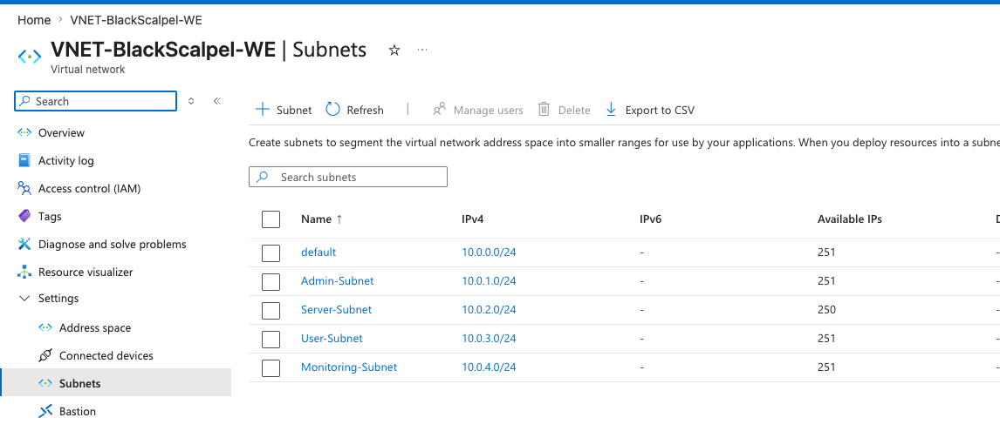

# Network Design

## Azure Network

- VNet: VNET-BlackScalpel-WE
- Region: West Europe
- Address Space: 10.0.0.0/16

## Subnets

| Subnet | CIDR | Purpose |
|---|---:|---|
| Admin-Subnet | 10.0.1.0/24 | Admin access and management |
| Server-Subnet | 10.0.2.0/24 | Domain controller and servers |
| User-Subnet | 10.0.3.0/24 | User/client systems |
| Monitoring-Subnet | 10.0.4.0/24 | Logging, SIEM, and monitoring |

## Azure Subnet Configuration

The lab VNet is segmented into separate subnets to support administration, servers, user systems, and monitoring tools.

## Current Server

- DC01: 10.0.2.10
- Subnet: Server-Subnet

## What This Demonstrates

- Azure VNet creation
- Subnet segmentation
- IP address planning
- Server subnet placement
- Basic network documentation
