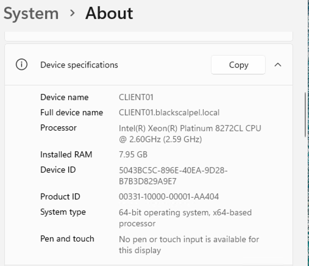
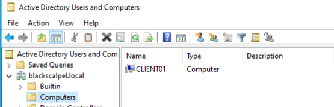

# Active Directory Build

## Domain

* Domain Name: blackscalpel.local
* Domain Controller: DC01
* Server OS: Windows Server 2022
* DNS Server: DC01 / 10.0.2.10

## Installed Roles

* Active Directory Domain Services
* DNS Server

## Organizational Units

The following organizational units were created to separate users, computers, and groups:

* MissionLab-Users
* MissionLab-Computers
* MissionLab-Groups

## Security Groups

The following security groups were created for basic role-based access structure:

* Training-Users
* Server-Admins
* Helpdesk-Techs

## Test Users

Two test accounts were created to simulate basic user and helpdesk roles:

* tuser1
* helpdesk1

## Group Membership Proof

The training user was assigned to the `Training-Users` group.

The helpdesk user was assigned to the `Helpdesk-Techs` group.

## Windows Client Domain Join

A Windows 11 client VM named `CLIENT01` was created in the `User-Subnet` and configured to use `DC01` as its DNS server.

The client successfully resolved `blackscalpel.local` through the domain controller and was joined to the domain.

The screenshot below shows `CLIENT01` appearing as a computer object in Active Directory Users and Computers.

## Notes

This section documents domain creation, OU structure, security groups, test users, group membership, DNS-based domain resolution, and Windows client domain join validation.
