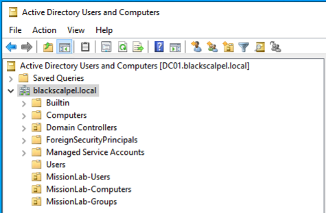
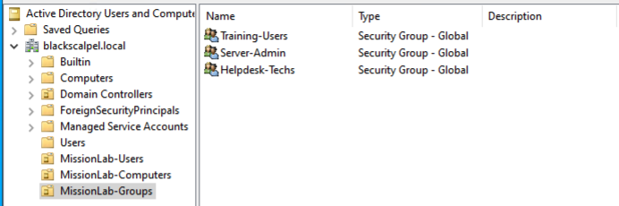
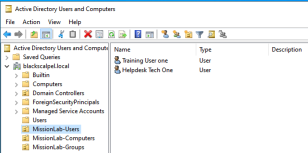
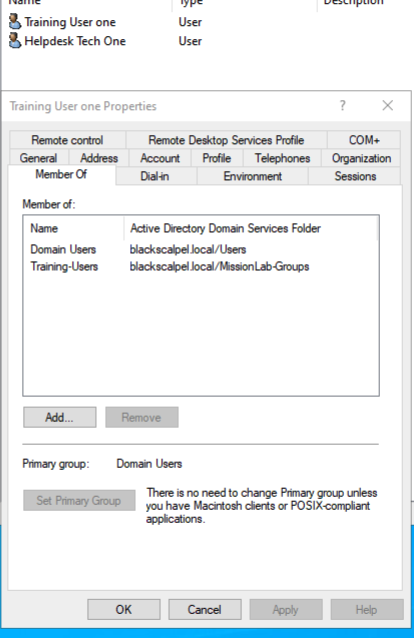
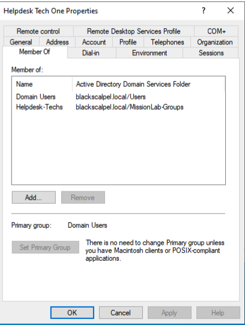

# Active Directory Build

## Domain

- Domain Name: blackscalpel.local
- Domain Controller: DC01
- Server OS: Windows Server 2022

## Installed Roles

- Active Directory Domain Services
- DNS Server

## Organizational Units

Created OUs to separate users, computers, and groups.

- MissionLab-Users
- MissionLab-Computers
- MissionLab-Groups

## Security Groups

Created security groups for role-based access control.

- Training-Users
- Server-Admins
- Helpdesk-Techs

## Test Users

Created test users for access-control validation.

- Training User One
- Helpdesk Tech One

## Group Membership Validation

Training User One was added to the Training-Users security group.

Helpdesk Tech One was added to the Helpdesk-Techs security group.

## What This Demonstrates

- Active Directory domain administration
- OU structure design
- User account creation
- Security group creation
- Group membership validation
- Basic role-based access control
