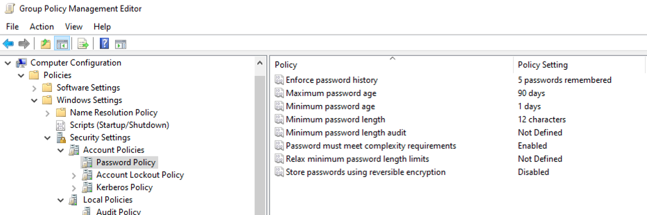
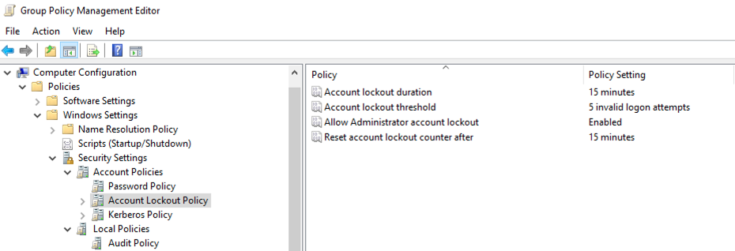
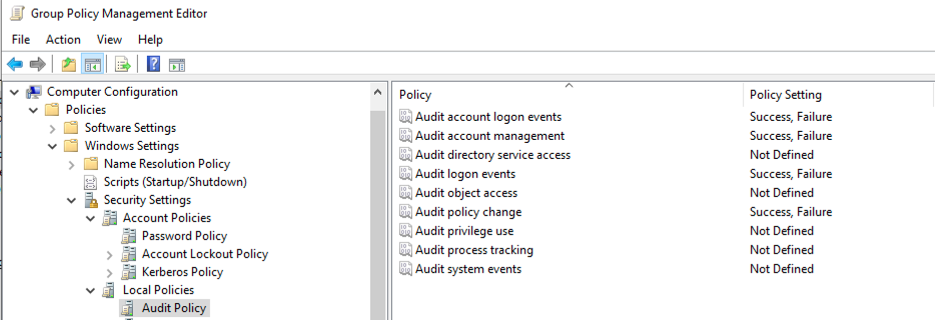

## Azure Network Security

The screenshot below shows DC01 network settings, private IP assignment, NSG association, and restricted inbound RDP access.

## Host Security Baseline

The screenshot below shows DC01 joined to the domain, Windows Firewall enabled, Microsoft Defender real-time protection enabled, and Remote Desktop enabled for administrative access.

## Group Policy Security Baseline

A domain-level Group Policy Object named `MissionLab-Security-Baseline` was created and linked to `blackscalpel.local`.

This GPO enforces password rules, account lockout controls, and audit logging for the domain.

### Password Policy

The password policy requires stronger passwords, prevents immediate password reuse, and disables weak reversible password storage.

### Account Lockout Policy

The account lockout policy locks accounts after repeated failed login attempts to reduce brute-force password attacks.

### Audit Policy

The audit policy logs successful and failed account logons, account management changes, logon events, and policy changes.

