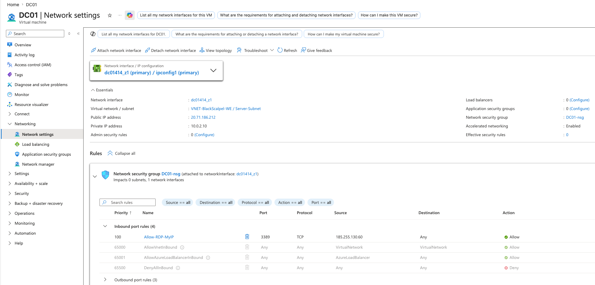

# Security Controls

## Current Controls

- DC01 uses a static private IP address: 10.0.2.10.
- DC01 is placed in the Server-Subnet.
- Network Security Group: DC01-nsg.
- RDP is restricted to a specific source IP during administrative setup.
- Default inbound deny rule remains in place.
- Windows Firewall is enabled.
- Microsoft Defender basic protection is enabled.
- Domain authentication is active through blackscalpel.local.

## Azure Network Security

The screenshot below shows DC01 network settings, private IP assignment, NSG association, and restricted inbound RDP access.

## Planned Controls

- Remove public IP after remote setup is complete.
- Continue restricting RDP access by source IP.
- Configure password policy.
- Configure account lockout policy.
- Use least-privilege security groups.
- Document patching process.
- Enable audit logging.

## What This Demonstrates

- Azure NSG review
- Secure RDP planning
- Private IP assignment
- Server subnet placement
- Basic remote-access hardening
- Security documentation
