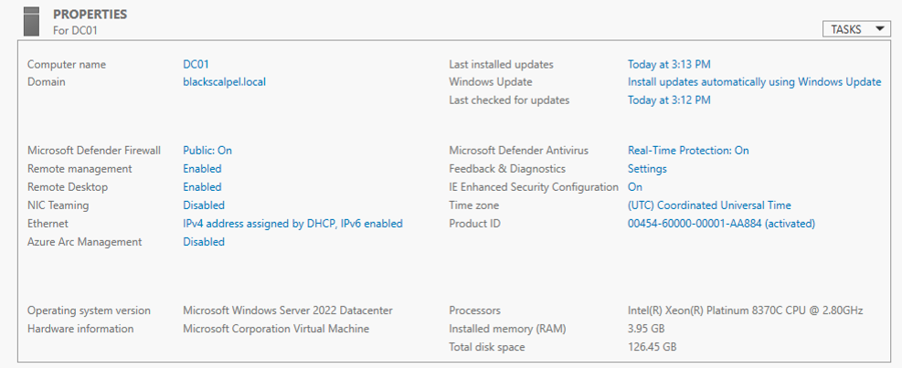

## Azure Network Security

The screenshot below shows DC01 network settings, private IP assignment, NSG association, and restricted inbound RDP access.

## Host Security Baseline

The screenshot below shows DC01 joined to the domain, Windows Firewall enabled, Microsoft Defender real-time protection enabled, and Remote Desktop enabled for administrative access.

