# Troubleshooting Tickets

This section documents realistic support and system administration tickets recreated inside the Secure Mission Training Environment Lab.

Each ticket includes the issue, symptoms, root cause, resolution, and proof collected from the lab.

## Ticket 1: User Account Locked Out

### Issue

A training user reported they could not log in to the domain.

### Symptoms

The account was locked after multiple failed authentication attempts.

### Root Cause

The domain account lockout policy triggered after repeated bad password attempts.

### Resolution

The account was reviewed in Active Directory Users and Computers. The locked account was confirmed and then unlocked from the Account tab.

### Proof

Account lockout confirmed in Active Directory:

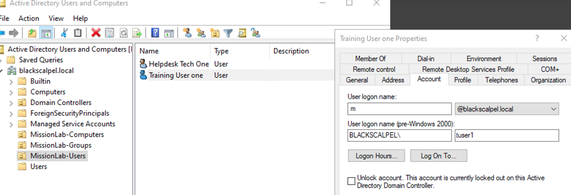

Account restored after unlocking:

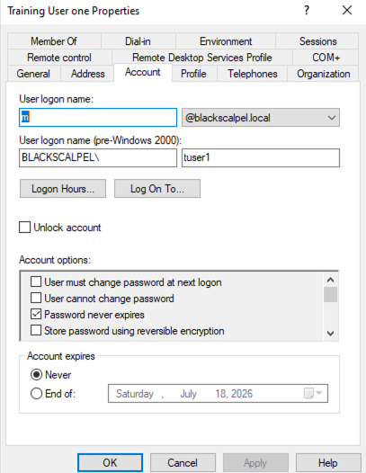

### Skills Demonstrated

* Active Directory user troubleshooting
* Account lockout investigation
* User account recovery
* Domain security policy validation

## Ticket 2: DNS Misconfiguration Preventing Domain Resolution

### Issue

A domain client could not resolve `blackscalpel.local`.

### Symptoms

`nslookup blackscalpel.local` failed when the client was pointed to the wrong DNS server.

### Root Cause

The client DNS server was manually changed to `8.8.8.8`, which cannot resolve the internal Active Directory domain.

### Resolution

The DNS server was changed back to the domain controller IP address `10.0.2.10`. The DNS resolver cache was flushed, and domain resolution was confirmed.

### Proof

DNS working before the issue:

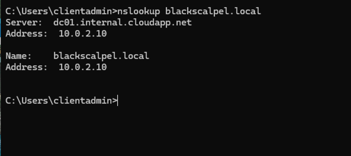

DNS failure after incorrect DNS configuration:

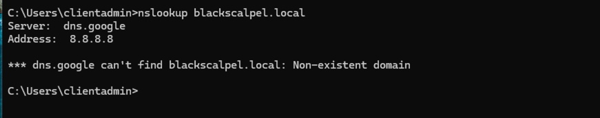

DNS restored after pointing back to DC01:

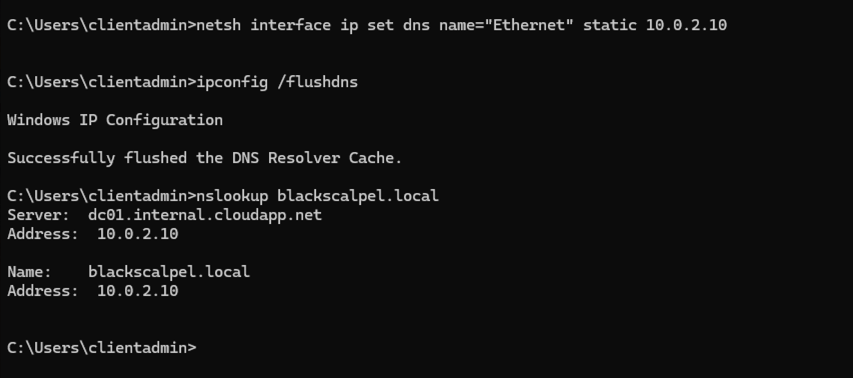

### Skills Demonstrated

* DNS troubleshooting
* Domain resolution validation
* Client network configuration
* `nslookup` usage
* DNS cache flushing

## Ticket 3: RDP Blocked by Network Security Group Rule

### Issue

Remote Desktop access to `CLIENT01` failed.

### Symptoms

The RDP client returned an unable-to-connect error.

### Root Cause

The Azure Network Security Group rule for RDP was changed from Allow to Deny.

### Resolution

The NSG inbound rule was corrected to allow RDP port `3389` only from the approved administrator public IP.

### Proof

RDP rule changed to Deny:

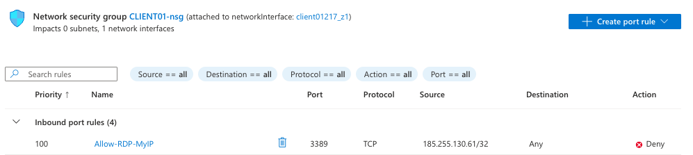

RDP connection failure:

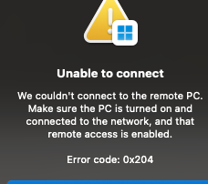

RDP rule restored to Allow:

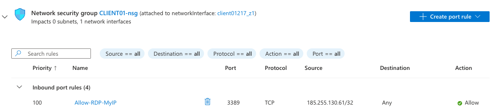

RDP connection restored:

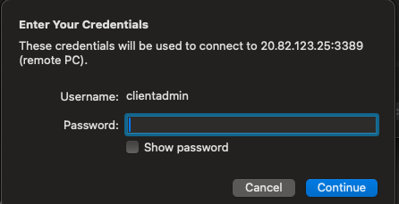

### Skills Demonstrated

* Azure NSG troubleshooting
* RDP connectivity investigation
* Firewall rule validation
* Secure remote access configuration

## Ticket 4: GPO Not Applying Because Computer Was in Wrong Container

### Issue

A domain-joined client was not receiving the expected Group Policy settings.

### Symptoms

The client computer was joined to the domain but was still located in the default `Computers` container.

### Root Cause

The computer object was not placed in the correct Organizational Unit. GPOs are commonly scoped to OUs, so the client needed to be moved into `MissionLab-Computers`.

### Resolution

`CLIENT01` was moved from the default `Computers` container into the `MissionLab-Computers` OU. Group Policy was then refreshed using `gpupdate /force`, and `gpresult /r` confirmed the security baseline GPO applied.

### Proof

CLIENT01 in the default Computers container:

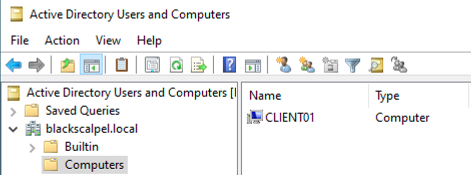

CLIENT01 moved to the correct MissionLab-Computers OU:

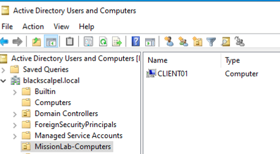

Group Policy applied and verified with gpresult:

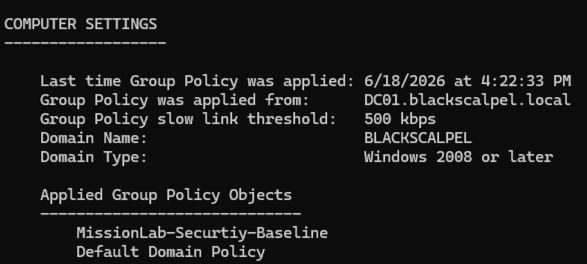

### Skills Demonstrated

* Active Directory computer object management
* OU-based policy scoping
* GPO troubleshooting
* `gpupdate` usage
* `gpresult` validation
* Policy application verification

## Summary

These tickets demonstrate practical troubleshooting across Active Directory, DNS, Azure network security, remote access, and Group Policy.

The lab shows the ability to identify symptoms, isolate root cause, apply a fix, and collect proof of resolution.
