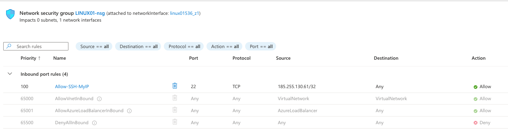
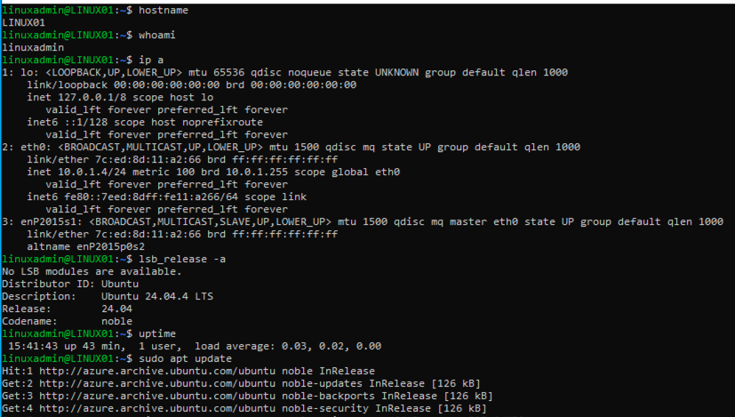

# Linux Administration

## Linux VM Deployment

A Linux VM named `LINUX01` was created in Azure to demonstrate basic Linux administration inside the secure mission training environment.

## System Details

- VM Name: LINUX01
- OS: Ubuntu Server 24.04 LTS
- Subnet: Admin-Subnet
- Private IP: 10.0.1.4
- Admin User: linuxadmin
- SSH Access: Restricted to approved public IP only

## Network Security

SSH access to `LINUX01` was restricted through the Azure Network Security Group so that port 22 is only accessible from the approved administrator public IP.

## Basic Linux Administration Commands

The screenshot below shows basic Linux administration verification commands, including hostname, active user, IP configuration, OS version, uptime, and package repository update.

## Skills Demonstrated

- Linux VM deployment in Azure
- SSH administration
- Private IP validation
- Ubuntu version verification
- Package repository update
- Network security group restriction for SSH
