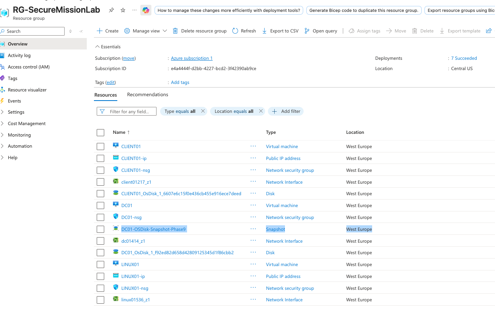
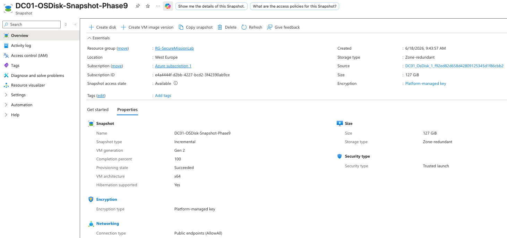

# Backup and Disaster Recovery

## DC01 OS Disk Snapshot

A snapshot was created for the `DC01` operating system disk to demonstrate basic backup and disaster recovery preparation.

The snapshot provides a recovery point for the domain controller OS disk in case the server becomes corrupted, misconfigured, or needs to be restored.

## Backup Details

* Protected system: `DC01`
* Resource group: `RG-SecureMissionLab`
* Snapshot name: `DC01-OSDisk-Snapshot-Phase9`
* Source disk: `DC01_OSDisk`
* Region: `West Europe`
* Snapshot type: `Incremental`
* Disk size: `127 GiB`
* Encryption: Platform-managed key

## Snapshot Proof

The screenshot below shows the snapshot resource inside the lab resource group.

The screenshot below shows detailed snapshot properties, including source disk, size, region, and snapshot type.

## Recovery Concept

If `DC01` failed or became misconfigured, the snapshot could be used to create a new managed disk and recover the server from the saved OS disk state.

## Skills Demonstrated

* Azure disk snapshot creation
* Backup validation
* Disaster recovery planning
* Domain controller protection
* Recovery point documentation
