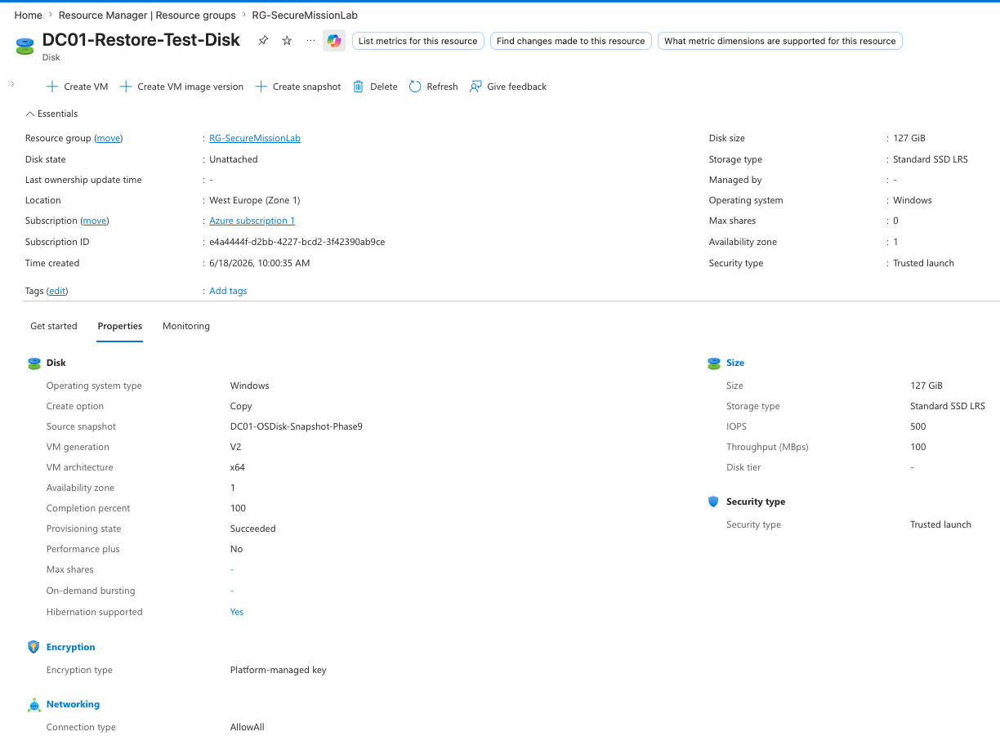

# Backup and Disaster Recovery

## DC01 Backup Snapshot

A snapshot was created for the `DC01` operating system disk to demonstrate basic backup and disaster recovery protection for the lab domain controller.

This provides a recovery point that could be used if `DC01` became corrupted, misconfigured, or unavailable.

## Snapshot Details

* Protected system: `DC01`
* Resource group: `RG-SecureMissionLab`
* Snapshot name: `DC01-OSDisk-Snapshot-Phase9`
* Source disk: `DC01_OSDisk`
* Region: `West Europe`
* Snapshot type: `Incremental`
* Disk size: `127 GiB`
* Encryption: Platform-managed key

## Snapshot Proof

The screenshot below shows the snapshot resource inside the lab resource group.

The screenshot below shows detailed snapshot properties, including source disk, size, region, and snapshot type.

## Restore Readiness Test

A managed disk named `DC01-Restore-Test-Disk` was created from the snapshot to prove that the backup could be converted into a usable recovery disk.

The restore test disk was not attached to a VM because the goal was to validate recovery readiness without affecting the active domain controller.

## Restore Test Proof

The screenshot below shows the test restore disk created from the snapshot.

## Recovery Concept

If `DC01` failed, the snapshot could be used to create a new managed disk. That disk could then be used to create a replacement VM or recover the server from the saved OS disk state.

## Skills Demonstrated

* Azure disk snapshot creation
* Backup validation
* Restore-readiness testing
* Managed disk creation from snapshot
* Disaster recovery planning
* Domain controller recovery documentation
