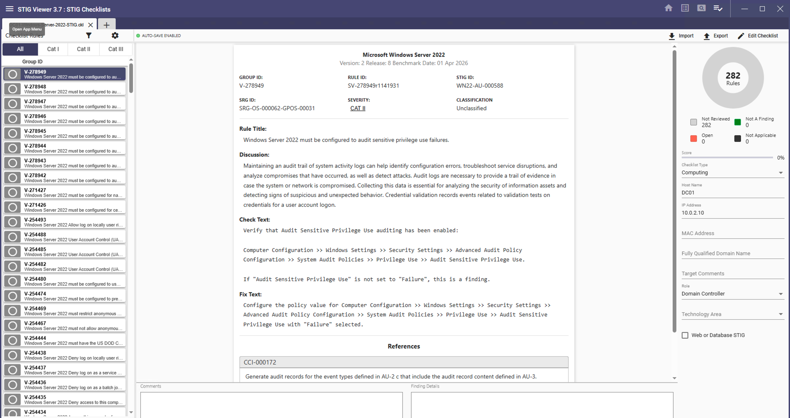
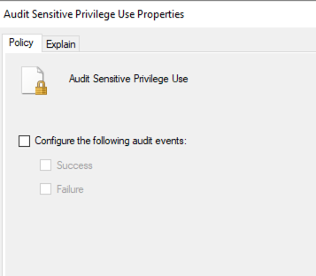
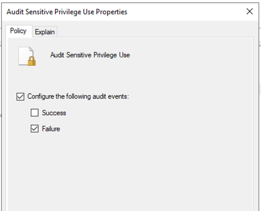
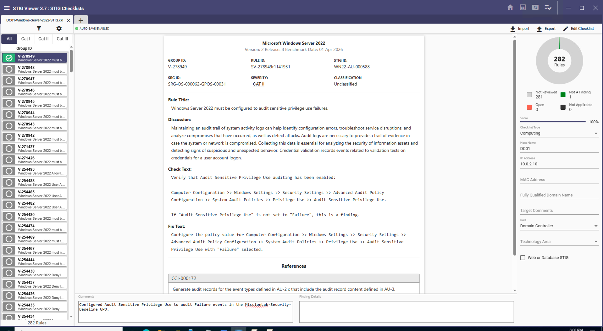

# DISA STIG Assessment

## Purpose

This phase documents a DISA STIG review performed against `DC01`, the Windows Server 2022 domain controller in the lab.

The goal was not to claim full DoD compliance. The goal was to demonstrate the ability to download official STIG content, review a STIG requirement, identify a finding, apply a safe remediation, and document the result.

## Tools Used

* DISA STIG Viewer 3.7
* Microsoft Windows Server 2022 STIG
* Target system: `DC01`
* Role: Domain Controller
* IP address: `10.0.2.10`

## STIG Checklist Created

A Windows Server 2022 STIG checklist was created for `DC01` in STIG Viewer.

The checklist was configured with the target host name, IP address, and system role.

## Reviewed STIG Rule

The reviewed rule was:

* Rule ID: `SV-278949r1141931`
* Vulnerability ID: `V-278949`
* STIG ID: `WN22-AU-000588`
* Severity: `CAT II`
* Rule title: Windows Server 2022 must be configured to audit sensitive privilege use failures.

## Finding Before Remediation

The rule required `Audit Sensitive Privilege Use` to audit `Failure` events.

Before remediation, the setting was not configured in Group Policy.

## Remediation Applied

The setting was configured in the `MissionLab-Security-Baseline` GPO.

Path used:

`Computer Configuration → Policies → Windows Settings → Security Settings → Advanced Audit Policy Configuration → System Audit Policies → Privilege Use → Audit Sensitive Privilege Use`

The policy was configured to audit:

* Failure events: Enabled
* Success events: Not selected

## STIG Viewer Result

After remediation, the rule was marked as `NotAFinding` in STIG Viewer with a comment documenting the fix.

## What This Demonstrates

This lab demonstrates basic STIG workflow:

* Downloading official DISA STIG content
* Creating a STIG checklist for a target system
* Reviewing a STIG rule
* Identifying a finding
* Applying a safe Group Policy remediation
* Documenting the result in STIG Viewer
* Preserving screenshot evidence for audit-style review

## Important Note

This is a lab-based STIG assessment example. It does not claim full Windows Server 2022 STIG compliance. Full compliance would require reviewing all applicable rules, documenting exceptions, validating mission impact, and completing formal approval or risk acceptance.
