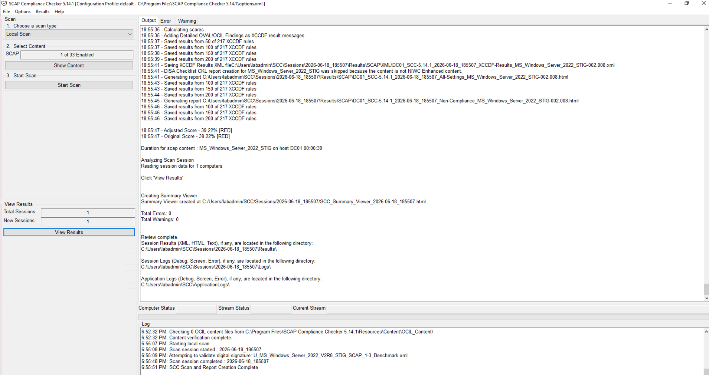
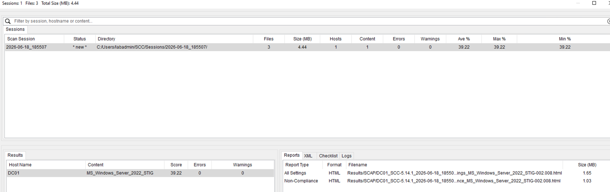
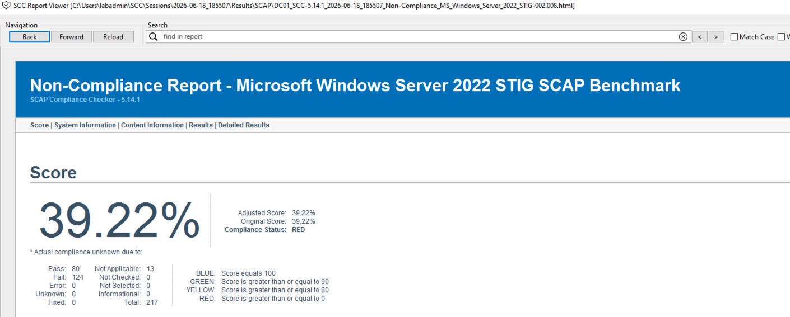
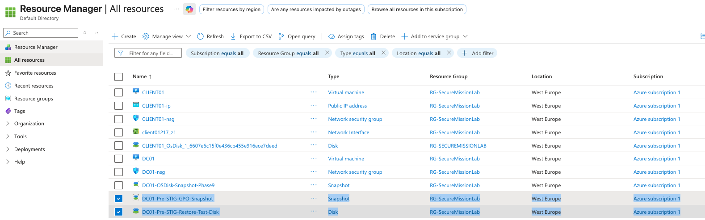
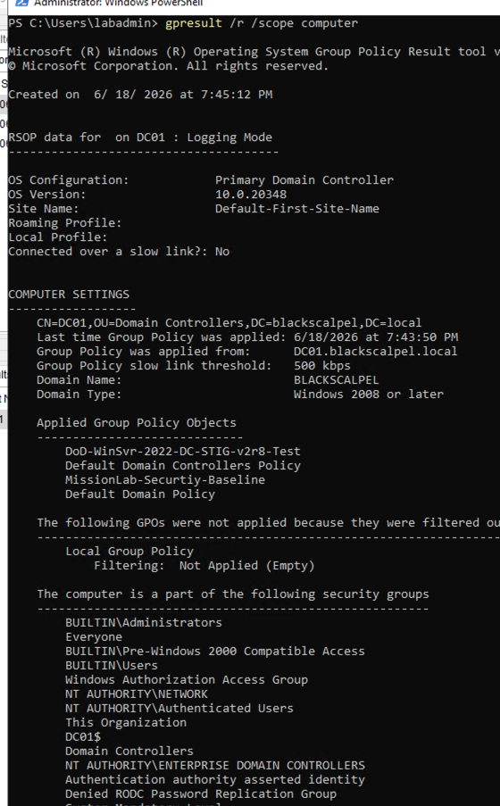
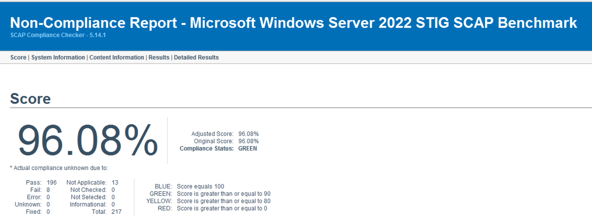

# DISA STIG Assessment and Remediation

This phase documents a lab-based DISA STIG assessment and remediation workflow for the `DC01` Windows Server 2022 domain controller in the Secure Mission Training Environment.

The goal was to demonstrate how a system administrator can identify STIG findings, apply security baseline remediation, verify Group Policy application, and validate improvement using DISA SCAP Compliance Checker.

> This lab does not represent formal DoD authorization, ATO approval, or full production compliance. It demonstrates a practical STIG assessment, remediation, and validation workflow in a controlled lab environment.

---

## System Assessed

| Item                   | Value                              |
| ---------------------- | ---------------------------------- |
| Server                 | `DC01`                             |
| Role                   | Primary Domain Controller          |
| Domain                 | `blackscalpel.local`               |
| Operating System       | Windows Server 2022                |
| Private IP             | `10.0.2.10`                        |
| STIG Baseline          | Microsoft Windows Server 2022 STIG |
| STIG Version / Release | Version 2, Release 8               |
| SCAP Tool              | SCAP Compliance Checker 5.14.1     |

---

## Manual STIG Checklist Review

I installed DISA STIG Viewer and imported the Microsoft Windows Server 2022 STIG benchmark.

A checklist was created for `DC01` using the Windows Server 2022 STIG baseline.

Checklist location on the server:

`C:\STIG\DC01\DC01-Windows-Server-2022-STIG.ckl`

The checklist identified `DC01` as a Windows Server 2022 domain controller and loaded the applicable STIG rule set for review.


---

## Example Manual Finding Reviewed

One manual STIG item reviewed was:

| Field            | Value                                                                            |
| ---------------- | -------------------------------------------------------------------------------- |
| Vulnerability ID | `V-278949`                                                                       |
| Rule ID          | `SV-278949r1141931`                                                              |
| STIG ID          | `WN22-AU-000588`                                                                 |
| Severity         | CAT II                                                                           |
| Rule Title       | Windows Server 2022 must be configured to audit sensitive privilege use failures |

The initial review showed that `Audit Sensitive Privilege Use` was not configured for failure auditing.


---

## Manual Remediation Performed

The setting was remediated through Group Policy.

Policy path:

`Computer Configuration → Policies → Windows Settings → Security Settings → Advanced Audit Policy Configuration → System Audit Policies → Privilege Use → Audit Sensitive Privilege Use`

Configured setting:

* `Configure the following audit events`: Enabled
* `Failure`: Enabled
* `Success`: Not enabled


After remediation, the finding was marked as `NotAFinding` in STIG Viewer with the following comment:

`Configured Audit Sensitive Privilege Use to audit Failure events in the MissionLab-Security-Baseline GPO.`


---

## Baseline Automated SCAP Scan

After completing the manual review example, I used DISA SCAP Compliance Checker to run an automated Windows Server 2022 STIG scan against `DC01`.

The baseline scan was run before applying the DISA Domain Controller STIG GPO.

Baseline SCC result:

| Metric            | Result                                            |
| ----------------- | ------------------------------------------------- |
| Tool              | SCAP Compliance Checker 5.14.1                    |
| Target            | `DC01`                                            |
| Content           | Microsoft Windows Server 2022 STIG SCAP Benchmark |
| Compliance Score  | `39.22%`                                          |
| Compliance Status | `RED`                                             |
| Pass              | `80`                                              |
| Fail              | `124`                                             |
| Not Applicable    | `13`                                              |
| Total Checked     | `217`                                             |
| Errors            | `0`                                               |







---

## Recovery Checkpoint Before Applying DISA GPO

Before applying the DISA Domain Controller STIG GPO, I created a fresh Azure recovery checkpoint.

This included:

* A new OS disk snapshot
* A restore-test disk created from that snapshot
* Verification that the restore disk deployed successfully

The purpose was to prove that the domain controller could be recovered if the DISA GPO broke authentication, RDP access, domain controller behavior, or other system functions.

Recovery resources created:

| Resource                          | Purpose                                            |
| --------------------------------- | -------------------------------------------------- |
| `DC01-Pre-STIG-GPO-Snapshot`      | Clean rollback point before applying DISA STIG GPO |
| `DC01-Pre-STIG-Restore-Test-Disk` | Restore validation disk created from the snapshot  |



The restore-test disk was deleted after validation to reduce cost. The snapshot was retained as the rollback point.

---

## DISA Domain Controller STIG GPO Import

I downloaded the official DISA STIG GPO package and selected the Windows Server 2022 Domain Controller baseline.

The correct GPO backup selected was:

`DoD WinSvr 2022 DC STIG Comp v2r8`

The Member Server GPO was not used for `DC01`.

The imported test GPO was named:

`DoD-WinSvr-2022-DC-STIG-v2r8-Test`

The GPO was linked only to the `Domain Controllers` OU so it applied to `DC01` and not broadly across the entire domain.

Final GPO link placement:

| OU                   | Linked GPO                          |
| -------------------- | ----------------------------------- |
| `Domain Controllers` | `DoD-WinSvr-2022-DC-STIG-v2r8-Test` |

The GPO was placed above the default domain controller policy in link order, but it was not enforced.

---

## Group Policy Application Verification

After importing and linking the DISA Domain Controller STIG GPO, I forced policy application on `DC01`.

Command used:

```cmd
gpupdate /force
```

Then I verified applied computer policies using:

```cmd
gpresult /r /scope computer
```

The result confirmed that the DISA Domain Controller STIG GPO applied successfully to `DC01`.

Applied computer GPOs included:

* `DoD-WinSvr-2022-DC-STIG-v2r8-Test`
* `Default Domain Controllers Policy`
* `MissionLab-Securtiy-Baseline`
* `Default Domain Policy`



---

## Post-GPO Automated SCAP Scan

After applying the DISA Domain Controller STIG GPO, I reran the SCC scan against `DC01`.

Post-GPO SCC result:

| Metric            | Result                                            |
| ----------------- | ------------------------------------------------- |
| Tool              | SCAP Compliance Checker 5.14.1                    |
| Target            | `DC01`                                            |
| Content           | Microsoft Windows Server 2022 STIG SCAP Benchmark |
| Compliance Score  | `96.08%`                                          |
| Compliance Status | `GREEN`                                           |
| Pass              | `196`                                             |
| Fail              | `8`                                               |
| Not Applicable    | `13`                                              |
| Total Checked     | `217`                                             |
| Errors            | `0`                                               |



---

## Before and After Result

| Scan Phase                           |    Score | Status  |  Pass |  Fail |
| ------------------------------------ | -------: | ------- | ----: | ----: |
| Baseline scan before DISA GPO        | `39.22%` | `RED`   |  `80` | `124` |
| Post-GPO scan after DISA DC STIG GPO | `96.08%` | `GREEN` | `196` |   `8` |

The SCC compliance score improved from `39.22% RED` to `96.08% GREEN`.

---

## Skills Demonstrated

This phase demonstrated the following system administration and security skills:

* DISA STIG Viewer usage
* Windows Server 2022 STIG checklist creation
* Manual STIG finding review
* Group Policy based remediation
* Advanced audit policy configuration
* DISA SCAP Compliance Checker usage
* Baseline vulnerability/compliance scanning
* DISA GPO package import
* Domain Controller GPO scoping
* Group Policy link order management
* `gpupdate` and `gpresult` validation
* Azure snapshot-based rollback planning
* Pre/post remediation compliance comparison
* Risk-aware security hardening workflow

---

## Result Summary

This phase demonstrated a complete STIG hardening workflow:

1. Created a Windows Server 2022 STIG checklist
2. Reviewed and remediated a manual CAT II audit policy finding
3. Ran a baseline SCC scan
4. Recorded the initial `39.22% RED` score
5. Created a rollback checkpoint using Azure snapshot and restore-test disk
6. Imported the DISA Windows Server 2022 Domain Controller STIG GPO
7. Linked the GPO only to the `Domain Controllers` OU
8. Forced policy application using `gpupdate /force`
9. Verified applied GPOs using `gpresult /r /scope computer`
10. Reran SCC validation
11. Confirmed improvement to `96.08% GREEN`

This does not claim production compliance or formal authorization. It shows hands-on experience with STIG assessment, GPO remediation, automated validation, and rollback planning in a domain controller lab environment.
