# 11 - Identity and Access Management Integration

## Objective

This phase integrated Active Directory with Keycloak to build a basic enterprise Identity and Access Management workflow. The goal was to prove that Active Directory users and groups could be synchronized into an identity provider, authenticated through OIDC, and used to access a protected internal mission application.

## Architecture

```text
Active Directory
    ↓ LDAP federation
Keycloak IAM Realm
    ↓ OIDC client
OAuth2 Proxy
    ↓ authenticated access
Mission Training App
```

## Completed Work

### 1. Active Directory IAM Groups

Created IAM-focused Active Directory security groups for role-based access control.

Groups created:

```text
IAM-Users
IAM-Admins
App-ReadOnly
App-Privileged
```

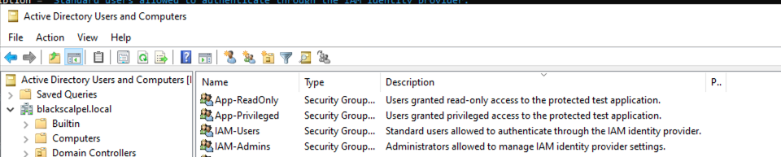

### 2. LDAP Bind Service Account

Created a dedicated LDAP bind service account for Keycloak to read users and groups from Active Directory.

Service account:

```text
svc-ldap-bind
```

The bind account was tested successfully from PowerShell before being used in Keycloak.

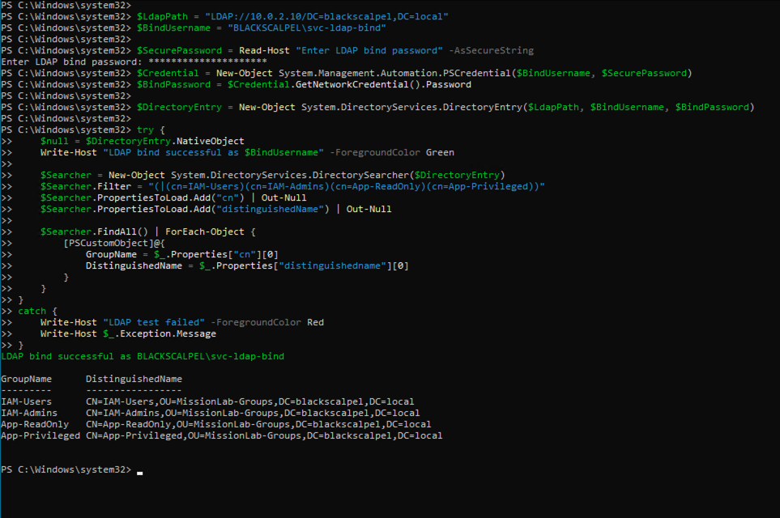

### 3. Linux-to-AD Connectivity

Verified that LINUX01 could reach the domain controller and connect to LDAP over port 389.

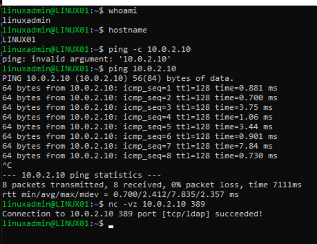

### 4. Keycloak Deployment

Deployed Keycloak in Docker on LINUX01 and confirmed access to the Keycloak admin console.

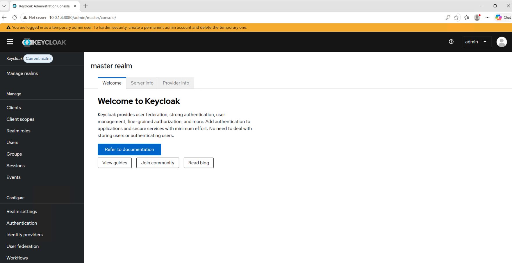

Created the dedicated IAM realm:

```text
blackscalpel
```

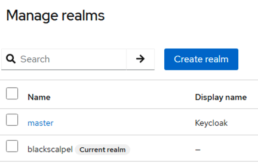

### 5. Active Directory User Federation

Configured Keycloak LDAP federation against Active Directory.

LDAP source:

```text
ldap://10.0.2.10:389
```

Users DN:

```text
OU=MissionLab-Users,DC=blackscalpel,DC=local
```

Bind DN:

```text
CN=svc-ldap-bind,OU=MissionLab-ServiceAccounts,DC=blackscalpel,DC=local
```

Confirmed LDAP connection and authentication testing.

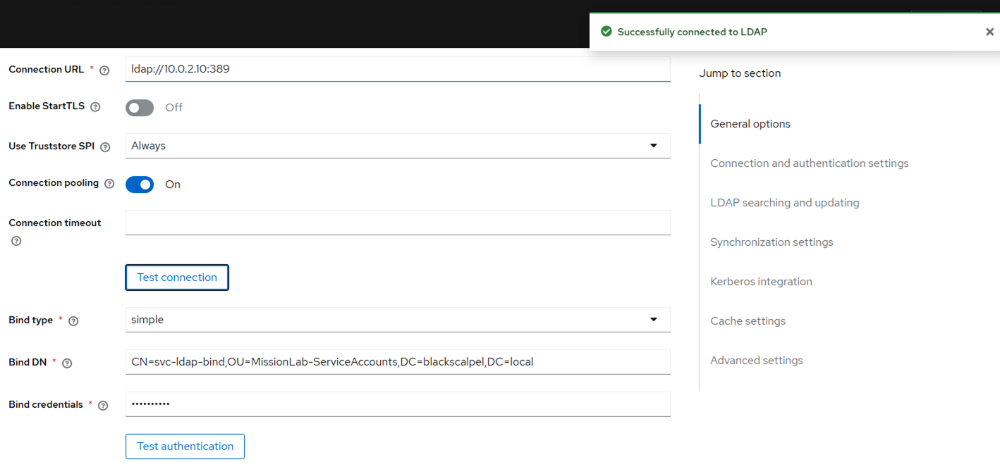

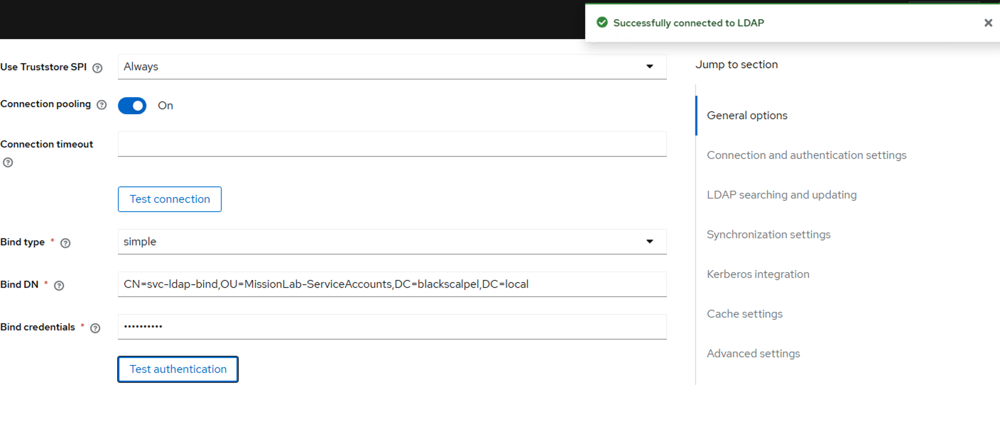

### 6. AD User Synchronization

Synchronized Active Directory users into Keycloak.

Synced users included:

```text
tuser1
helpdesk1
```

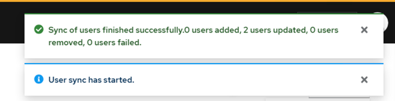

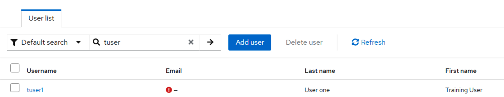

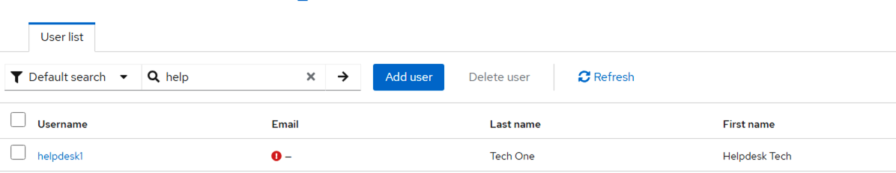

### 7. AD Group Synchronization

Configured an LDAP group mapper and synchronized Active Directory security groups into Keycloak.


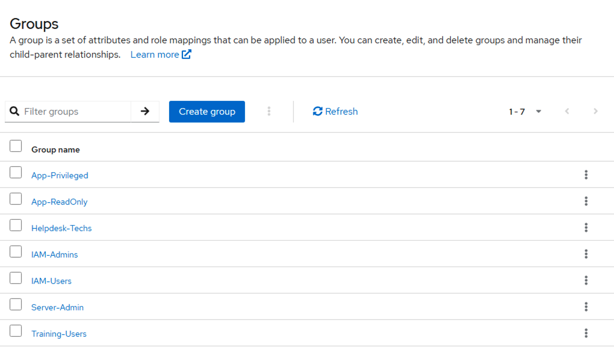

### 8. Group-Based Access Mapping

Mapped AD users into IAM access groups.

Example mappings:

```text
tuser1 → IAM-Users, App-ReadOnly
helpdesk1 → IAM-Users, IAM-Admins, App-Privileged
```

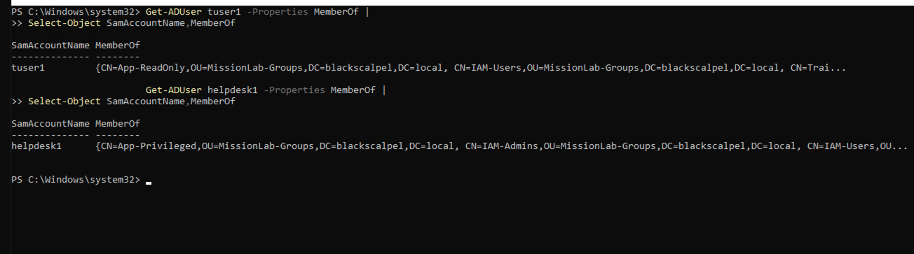

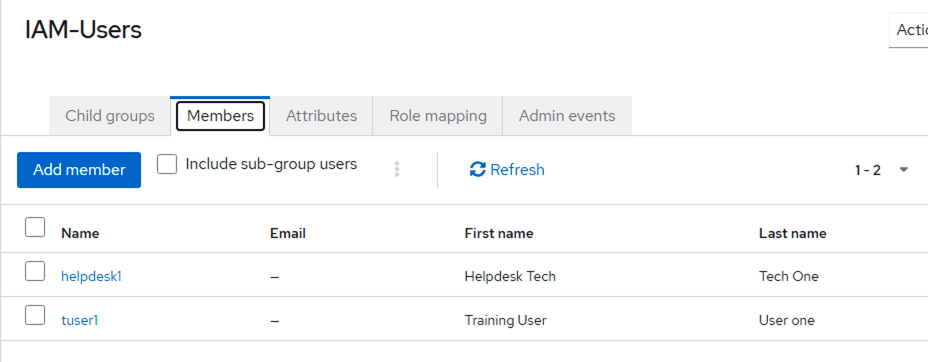

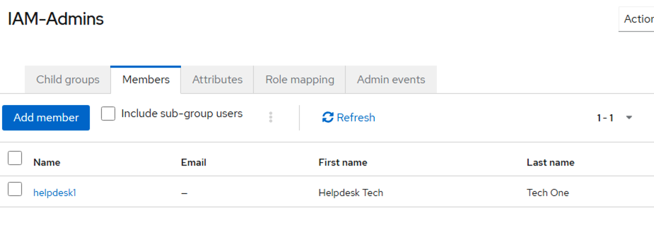

### 9. AD-Backed Keycloak Login

Confirmed that Active Directory users could authenticate through Keycloak using AD credentials.

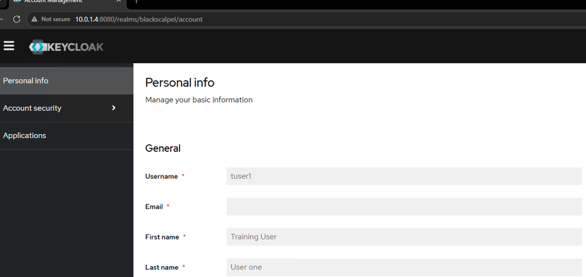

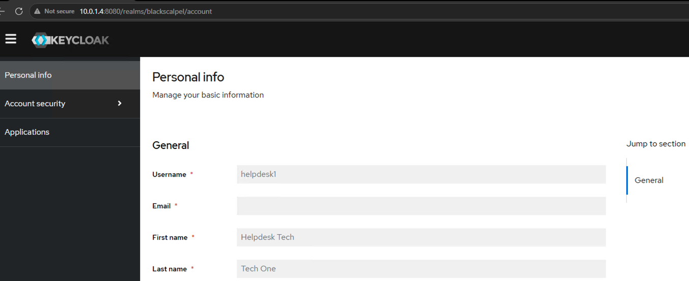

### 10. OIDC Client and Protected Mission App

Created an OIDC client for the mission application.

Client ID:

```text
mission-app
```

Configured OAuth2 Proxy to protect an internal Nginx-based mission training app.

Final access flow:

```text
User opens mission app
→ OAuth2 Proxy redirects to Keycloak
→ Keycloak authenticates AD user
→ OAuth2 Proxy grants access
→ Mission Training App loads successfully
```

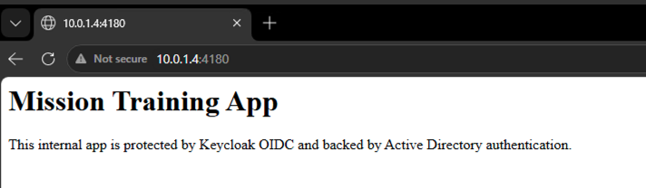

### 11. Container Runtime Proof

Final Docker containers:

```text
keycloak
mission-app
mission-app-proxy
```

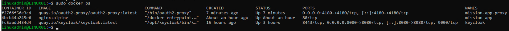

## Result

This phase proved a working IAM integration path:

```text
Active Directory user and group identity
→ LDAP federation into Keycloak
→ OIDC authentication
→ OAuth2 Proxy enforcement
→ protected internal application access
```

This demonstrates practical experience with identity federation, LDAP, OIDC, SSO, role-based access concepts, and containerized IAM infrastructure.

## Security Note

Client secrets were used only for lab testing. Any screenshot exposing secrets must not be committed to the repository. Secrets should be regenerated before final publication.
