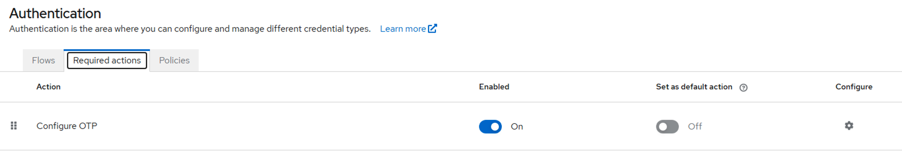
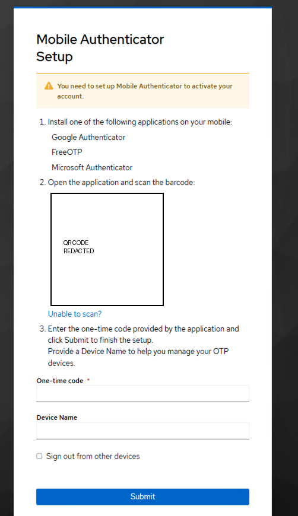
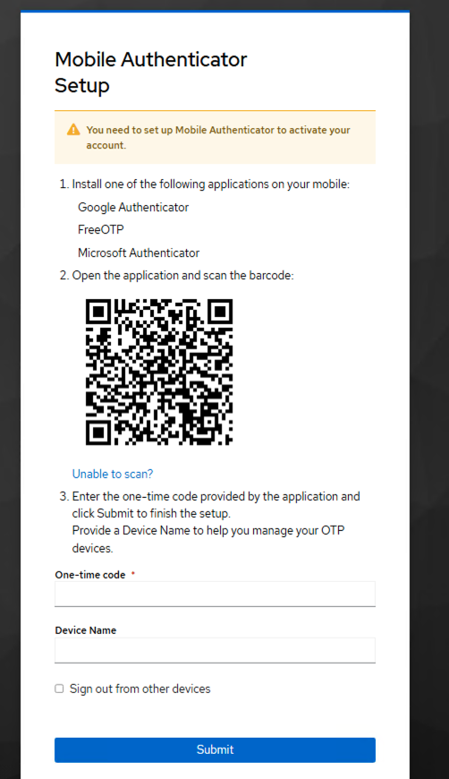
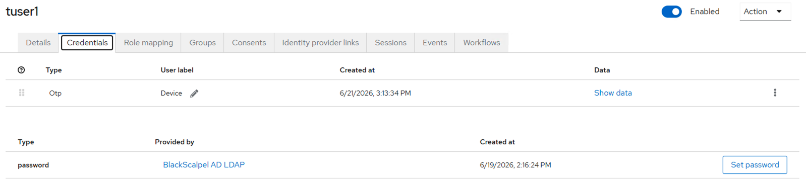

# 12 - Keycloak MFA Enforcement

## Objective

This phase added multi-factor authentication to the AD-backed Keycloak login flow. The goal was to require an Active Directory user to enroll an OTP authenticator before accessing the protected mission application.

## Completed Work

### 1. Enabled OTP Required Action

Enabled the Keycloak required action for OTP enrollment.

```text
Realm: blackscalpel
Authentication → Required actions
Configure OTP: Enabled
Default action: Off
```



### 2. Assigned MFA Enrollment to AD User

Assigned the `Configure OTP` required action to the AD-synced user `tuser1`.

```text
User: tuser1
Required user action: Configure OTP
```



The original QR-code screenshot was not committed because the QR code contains the OTP seed secret.

### 3. Completed Mobile Authenticator Enrollment

The user enrolled a mobile authenticator device during login.

```text
Device: tuser1-mobile-mfa
Credential type: OTP
```

### 4. Verified MFA-Protected Application Access

After password authentication and OTP verification, the user was redirected to the protected mission application.



### 5. Verified OTP Credential in Keycloak

Confirmed that Keycloak registered the OTP credential for the AD-backed user.



## Result

This phase verified the following authentication path:

```text
Active Directory user
→ Keycloak LDAP federation
→ password authentication
→ OTP enrollment
→ MFA verification
→ OAuth2 Proxy
→ protected mission app access
```
