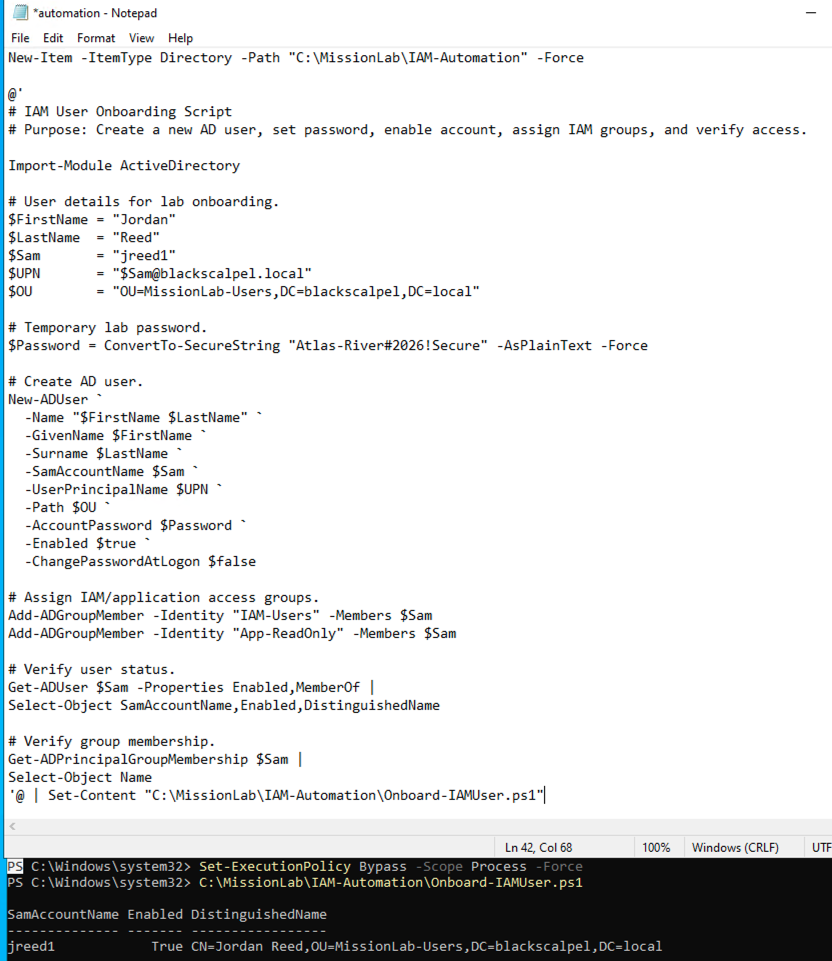
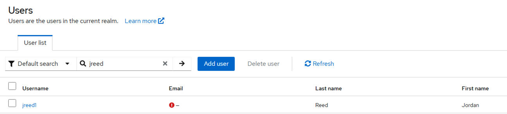
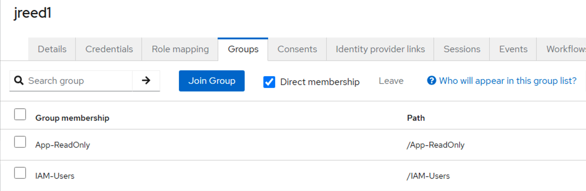
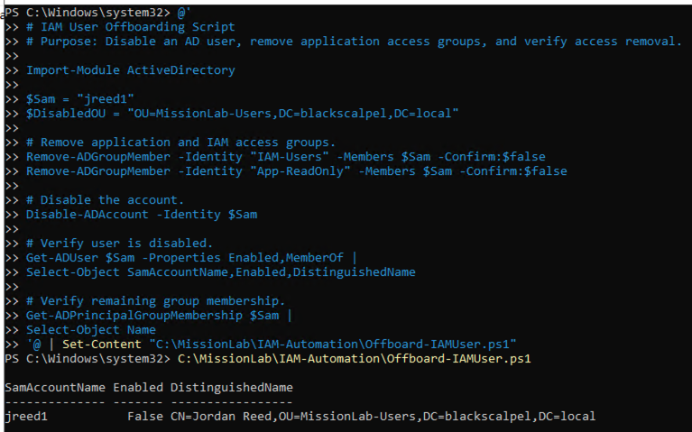
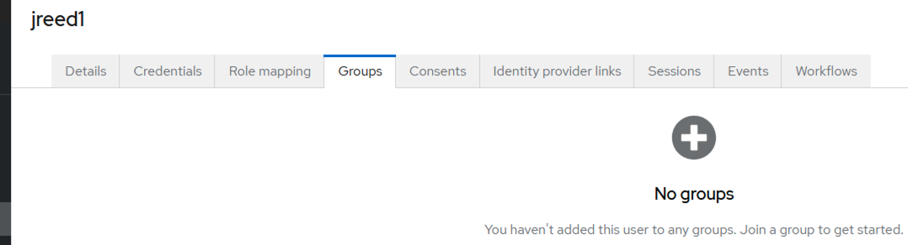
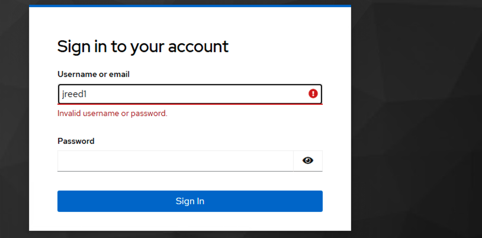

# 13 - IAM Lifecycle Automation

## Objective

This phase automated basic IAM user lifecycle tasks in Active Directory and verified that the changes synchronized into Keycloak.

The goal was to prove both onboarding and offboarding workflows:

```text
Onboarding → create user, enable account, assign access groups, sync to Keycloak
Offboarding → remove access groups, disable account, sync removal to Keycloak
```

## Completed Work

### 1. Verified IAM OUs and Groups

Confirmed the existing Active Directory OUs used for the lab.

```text
MissionLab-Users
MissionLab-Computers
MissionLab-Groups
MissionLab-ServiceAccounts
```

Confirmed IAM and application access groups.

```text
IAM-Users
IAM-Admins
App-ReadOnly
App-Privileged
```

### 2. Created IAM Onboarding Script

Created a PowerShell onboarding script at:

```text
C:\MissionLab\IAM-Automation\Onboard-IAMUser.ps1
```

The script created a new AD user:

```text
User: jreed1
Name: Jordan Reed
OU: MissionLab-Users
Enabled: True
Groups: IAM-Users, App-ReadOnly
```



### 3. Verified Keycloak User Synchronization

After running the onboarding script, the AD user was synchronized into Keycloak through LDAP federation.

```text
Keycloak user: jreed1
Source: BlackScalpel AD LDAP
```



### 4. Verified Keycloak Group Mapping

Confirmed that the AD group memberships synchronized into Keycloak.

```text
jreed1 groups:
App-ReadOnly
IAM-Users
```



### 5. Created IAM Offboarding Script

Created a PowerShell offboarding script at:

```text
C:\MissionLab\IAM-Automation\Offboard-IAMUser.ps1
```

The script removed access groups and disabled the AD user.

```text
User: jreed1
Enabled: False
Groups removed: IAM-Users, App-ReadOnly
```



### 6. Verified Access Removal in Keycloak

After syncing Keycloak again, the user no longer had application access groups.

```text
jreed1 groups: No groups
```



### 7. Verified Disabled User Login Blocked

Tested the disabled user against the protected mission application.

```text
User: jreed1
Result: Login blocked
```



## Result

This phase verified the IAM lifecycle flow:

```text
PowerShell automation
→ Active Directory account creation
→ AD group assignment
→ Keycloak LDAP synchronization
→ application access granted

PowerShell offboarding
→ AD group removal
→ account disabled
→ Keycloak access removed
→ login blocked
```
