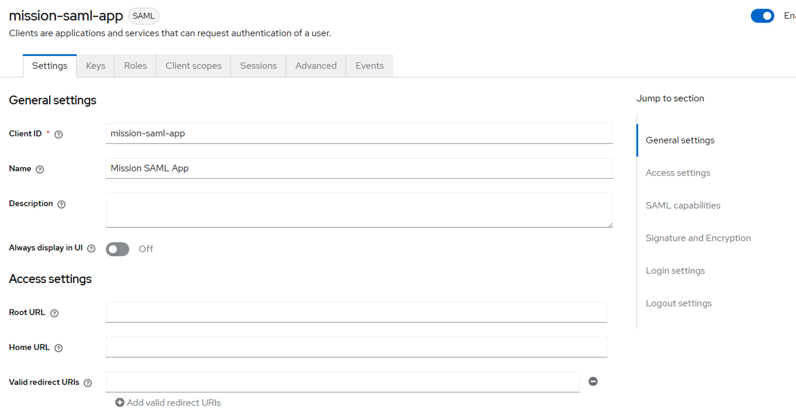
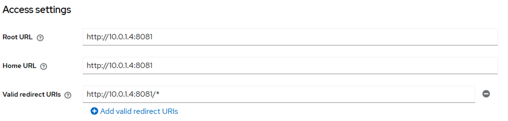
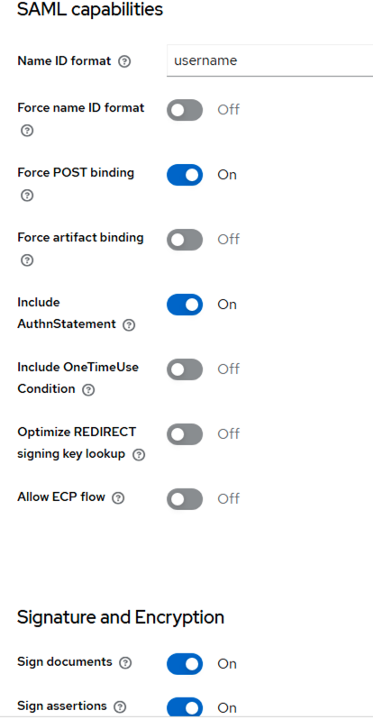
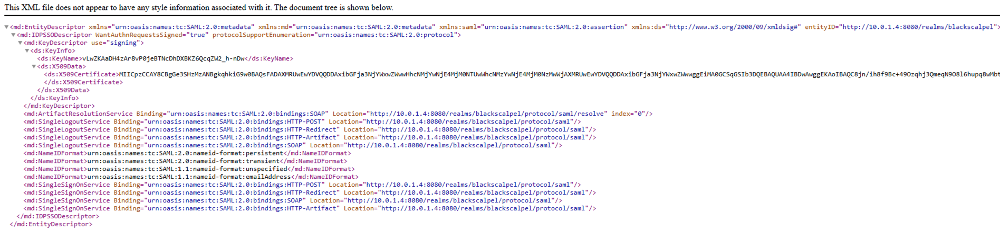
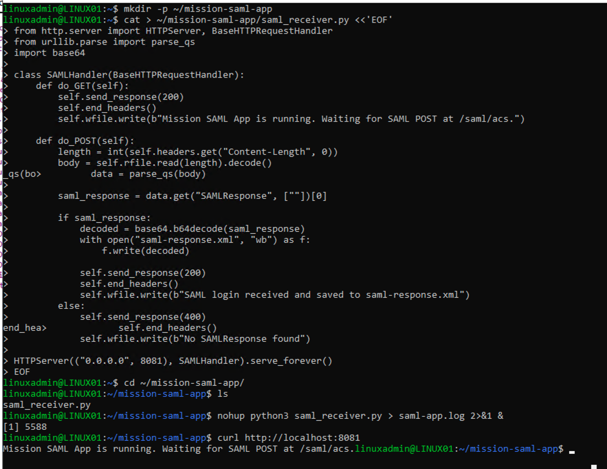
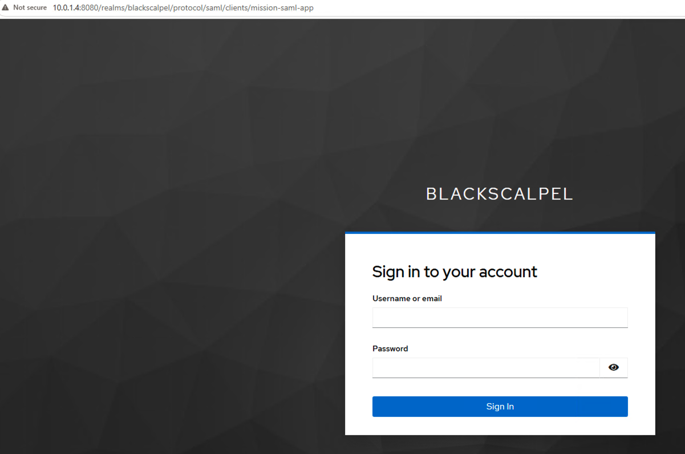
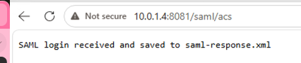
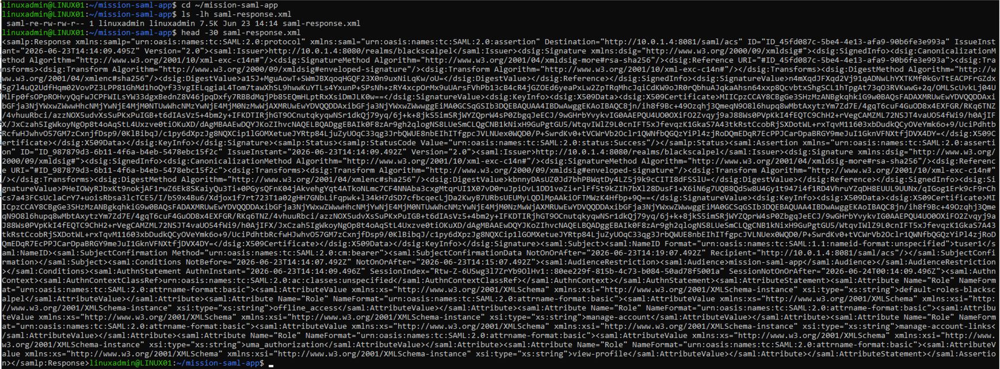
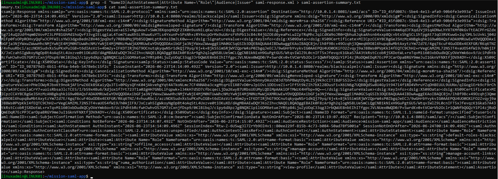

# 15 - SAML 2.0 Federation

## Objective

This phase added SAML 2.0 federation to the lab. The goal was to prove that Keycloak could act as a SAML Identity Provider and generate a signed SAML response for an AD-backed user.

## Concept

SAML federation uses an Identity Provider and a Service Provider.

```text
Identity Provider: Keycloak
Service Provider: Mission SAML App
User source: Active Directory through LDAP federation
```

Basic flow:

```text
User opens SAML login URL
→ Keycloak authenticates the AD-backed user
→ Keycloak generates a signed SAML response
→ Browser posts the SAML response to the app ACS endpoint
→ App receives and stores the decoded assertion
```

## Completed Work

### 1. Created SAML Client in Keycloak

Created a new SAML client in the `blackscalpel` realm.

```text
Client type: SAML
Client ID: mission-saml-app
Name: Mission SAML App
```



### 2. Configured SAML Access Settings

Configured the SAML application URLs.

```text
Root URL: http://10.0.1.4:8081
Home URL: http://10.0.1.4:8081
Valid redirect URIs: http://10.0.1.4:8081/*
Master SAML Processing URL: http://10.0.1.4:8081/saml/acs
IDP-Initiated SSO URL name: mission-saml-app
```



### 3. Configured SAML Capabilities and Signing

Configured SAML response behavior and signing.

```text
Name ID format: username
Force POST binding: On
Include AuthnStatement: On
Sign documents: On
Sign assertions: On
Signature algorithm: RSA_SHA256
```



### 4. Verified Keycloak SAML Metadata

Opened the Keycloak SAML IdP metadata endpoint.

```text
http://10.0.1.4:8080/realms/blackscalpel/protocol/saml/descriptor
```

This metadata describes how a SAML application can trust Keycloak.



### 5. Built SAML Test Receiver App

Created a simple Python SAML receiver on LINUX01.

```text
App path: ~/mission-saml-app/saml_receiver.py
Listening port: 8081
ACS endpoint: /saml/acs
```

The receiver accepts a browser POST containing `SAMLResponse`, decodes it, and saves it as:

```text
saml-response.xml
```



### 6. Started IdP-Initiated SAML Login

Opened the Keycloak IdP-initiated SAML login URL.

```text
http://10.0.1.4:8080/realms/blackscalpel/protocol/saml/clients/mission-saml-app
```

This started the SAML login flow from Keycloak.



### 7. Received SAML Response

After AD-backed login and MFA, Keycloak posted the SAML response to the test application.

```text
http://10.0.1.4:8081/saml/acs
```

The SAML receiver confirmed:

```text
SAML login received and saved to saml-response.xml
```



### 8. Verified SAML Assertion File

Verified that the decoded SAML response was saved on LINUX01.

```text
~/mission-saml-app/saml-response.xml
```



### 9. Created Readable Assertion Summary

Extracted important fields from the SAML response into a readable summary.

```text
NameID
Issuer
Audience
AuthnStatement
Role attributes
```



## Result

This phase verified the SAML federation path:

```text
Active Directory user
→ Keycloak LDAP federation
→ Keycloak SAML Identity Provider
→ signed SAML response
→ browser POST to ACS endpoint
→ SAML assertion saved and reviewed
```

This confirmed that the lab supports both major federation patterns:

```text
OIDC for the protected mission app
SAML 2.0 for the SAML test application
```
