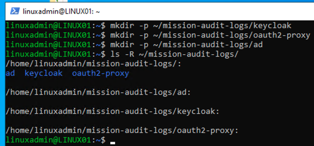
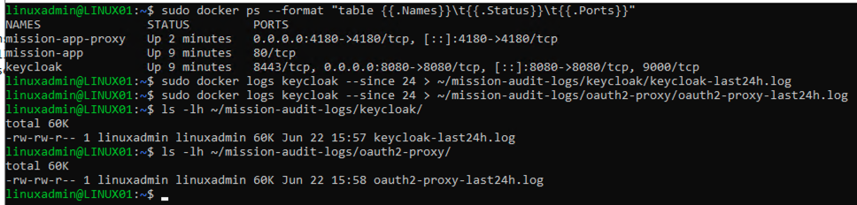
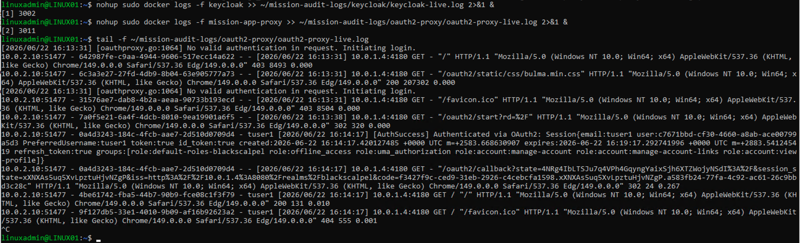
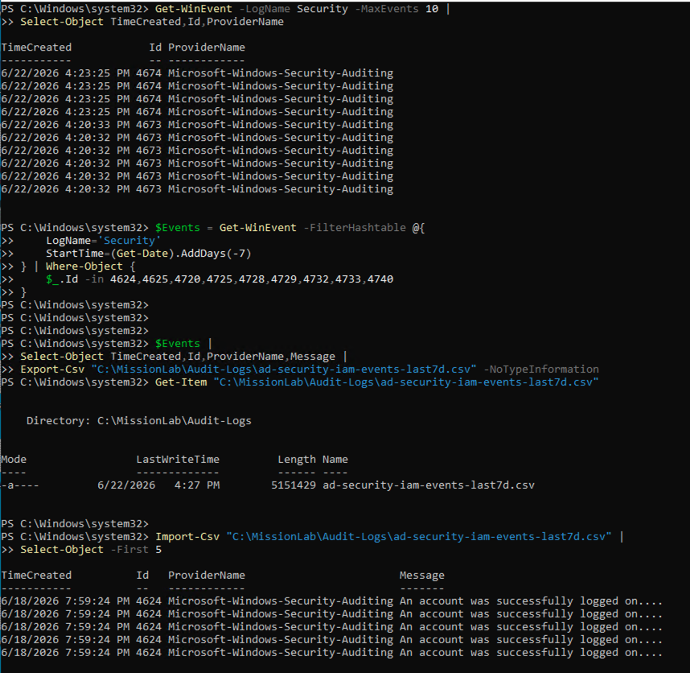
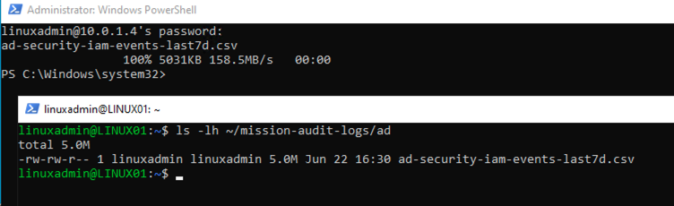
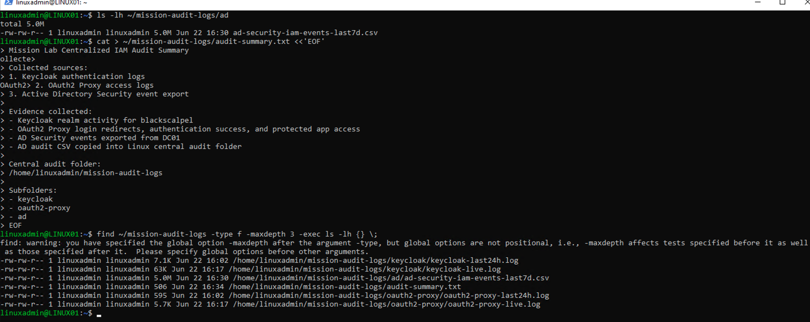
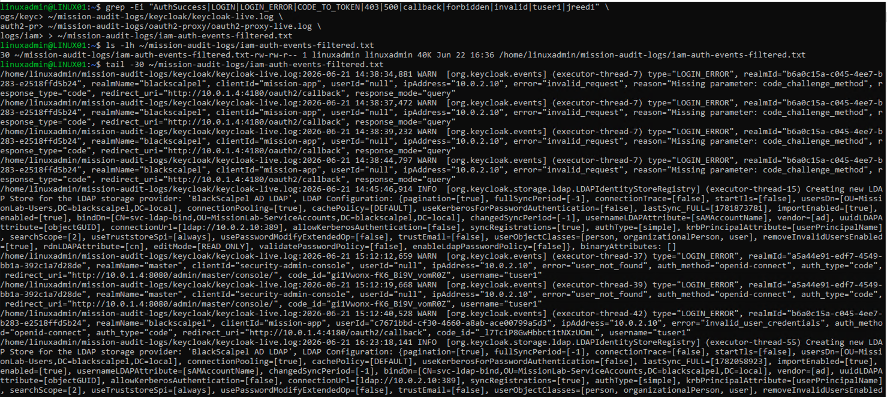
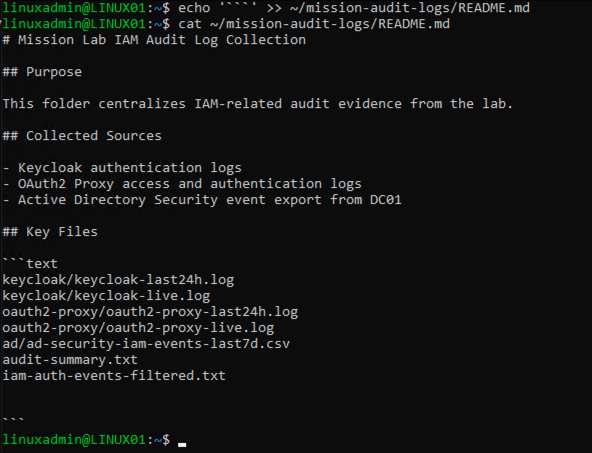

# 14 - Centralized IAM Audit Logging

## Objective

This phase centralized IAM-related audit evidence from Keycloak, OAuth2 Proxy, and Active Directory into a single audit log collection folder.

The goal was to collect authentication, access, and directory security evidence from multiple systems used in the lab.

## Completed Work

### 1. Created Central Audit Folder Structure

Created a centralized log collection folder on LINUX01.

```text
/home/linuxadmin/mission-audit-logs
```

Subfolders created:

```text
keycloak
oauth2-proxy
ad
```



### 2. Exported Keycloak and OAuth2 Proxy Logs

Exported recent logs from the Keycloak and OAuth2 Proxy Docker containers.

```text
keycloak/keycloak-last24h.log
oauth2-proxy/oauth2-proxy-last24h.log
```



### 3. Captured Live OAuth2 Proxy Authentication Events

Started live log collection for OAuth2 Proxy and captured the protected application access flow.

Events observed:

```text
403 = unauthenticated request blocked
302 = redirect to Keycloak login
AuthSuccess = user authenticated through OAuth2
200 = protected app loaded successfully
```



### 4. Exported Active Directory Security Events

Exported Active Directory security events from DC01 into a CSV file.

```text
C:\MissionLab\Audit-Logs\ad-security-iam-events-last7d.csv
```

Events included successful logons and privileged security operations.



### 5. Copied AD Events to Linux Collector

Copied the AD security event CSV into the Linux audit collection folder.

```text
/home/linuxadmin/mission-audit-logs/ad/ad-security-iam-events-last7d.csv
```



### 6. Created Central Audit Summary

Created a plain-text audit summary describing the collected log sources and evidence.

```text
/home/linuxadmin/mission-audit-logs/audit-summary.txt
```

Verified the centralized audit folder contained Keycloak, OAuth2 Proxy, AD, filtered event, and summary files.



### 7. Created Filtered IAM Event Report

Created a filtered report for IAM-related authentication and access events.

```text
/home/linuxadmin/mission-audit-logs/iam-auth-events-filtered.txt
```

The filtered report included login activity, blocked access, redirects, callback events, authentication success, and error evidence.



### 8. Created Audit Folder README

Created a README file inside the audit collection folder explaining the purpose and contents of the log collection.

```text
/home/linuxadmin/mission-audit-logs/README.md
```



## Result

This phase verified the centralized IAM audit flow:

```text
Keycloak authentication logs
→ OAuth2 Proxy access logs
→ Active Directory Security events
→ Linux audit collection folder
→ filtered IAM event report
```
